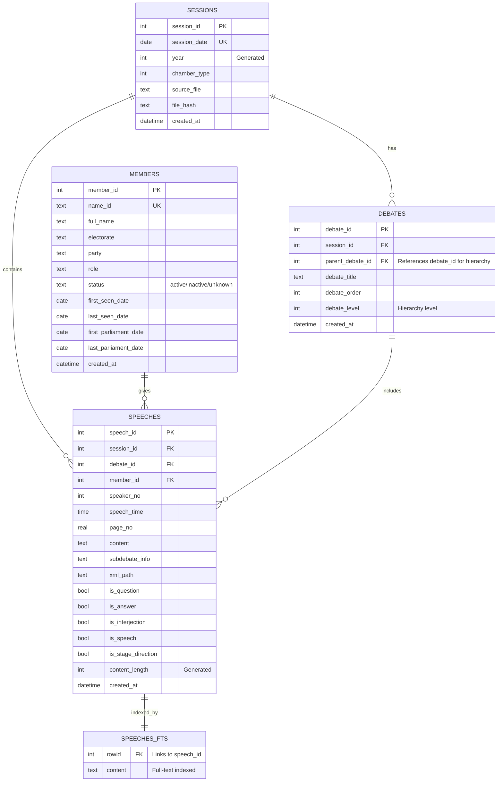
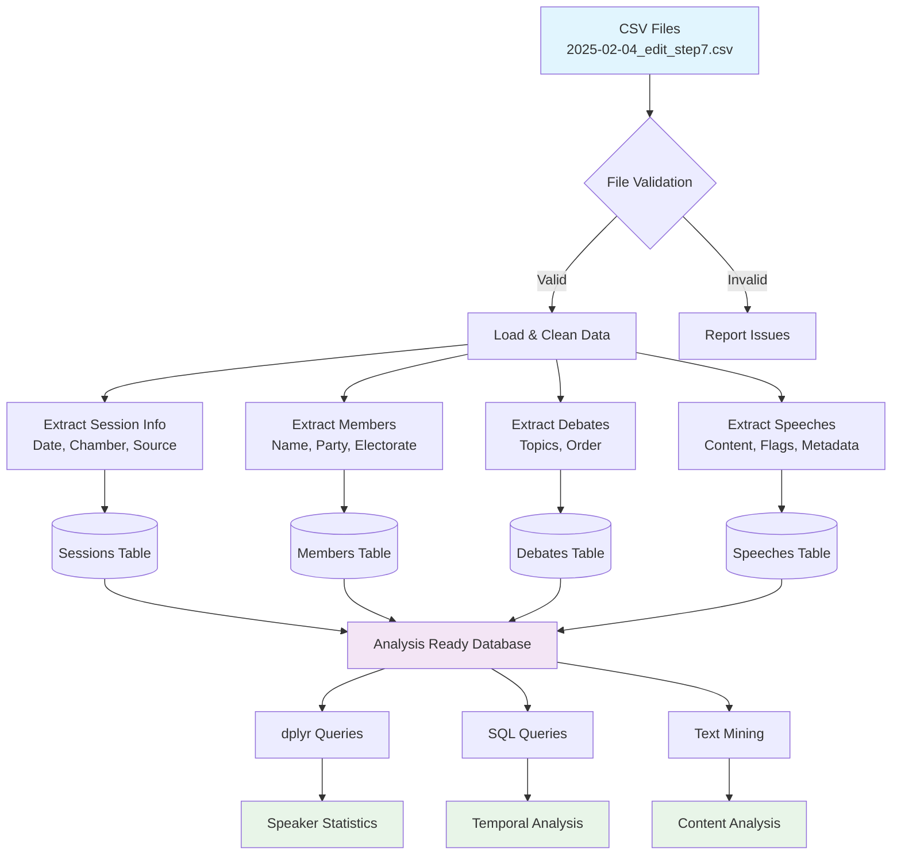

<!-- README.md is generated from README.Rmd. Please edit that file -->

```{r, include = FALSE}
knitr::opts_chunk$set(
  collapse = TRUE,
  comment = "#>",
  fig.path = "man/figures/README-",
  out.width = "100%"
)
```

# hansardR

<!-- badges: start -->
[](https://github.com/Australian-Parliamentary-Speech/hansardR/actions/workflows/R-CMD-check.yaml)
[](https://app.codecov.io/gh/Australian-Parliamentary-Speech/hansardR?branch=main)
[](https://CRAN.R-project.org/package=hansardR)
[](https://lifecycle.r-lib.org/articles/stages.html#experimental)
<!-- badges: end -->

A comprehensive R toolkit for processing, validating, and analysing Australian Parliamentary Hansard CSV data. Designed for computational social science research with robust data handling, validation, and structured database storage.

## Features

- 🗃️ **Database Creation**: Structured SQLite storage with optimised indexes and triggers
- ✅ **File Validation**: Comprehensive CSV structure and integrity checking  
- 📊 **Batch Processing**: Efficient import of large datasets with progress tracking
- 🔍 **Advanced Querying**: dplyr-compatible database interface for analysis
- 🔎 **Full-Text Search**: SQLite FTS5 powered content search with highlighting
- 📈 **Built-in Analytics**: Speaker statistics, temporal analysis, and content metrics
- ⚡ **Performance Optimized**: Strategic indexing and database triggers for speed
- 🛠️ **Modular Design**: Separate validation, processing, and analysis workflows
- 📚 **Rich Documentation**: Comprehensive vignettes and examples

## Installation

### Development Version (Recommended)

Install the latest development version from GitHub:

```{r eval=FALSE}
pak::pak("Australian-Parliamentary-Speech/hansardR")
```

### System Requirements

**R Version**: Requires R ≥ 4.1.0 (for native pipe operator `|>`)

**Dependencies**: The package will automatically install required dependencies:
- `DBI`, `RSQLite` - Database interface
- `dplyr`, `readr`, `purrr`, `stringr`, `tibble` - Data manipulation
- `progress` (optional) - Progress bars for batch operations

## Quick Start

```{r eval=FALSE}
library(hansardR)

# Create database
con <- create_hansard_database("hansard.db")

# Import single file
import_hansard_file("2025-02-04_edit_step7.csv", con)

# Get table references for analysis
tbls <- get_hansard_tables(con)

# Analyse with dplyr
top_speakers <- tbls$speeches |>
  left_join(tbls$members, by = "member_id") |>
  count(full_name, party, sort = TRUE) |>
  collect()

print(top_speakers)
```

## Sample Data

The package includes sample data for testing and learning:

```{r eval=FALSE}
# Explore included sample data
hansard_sample_info()

# Use sample data in examples
sample_path <- hansard_sample_data()
con <- create_hansard_database(tempfile(fileext = ".db"))
import_hansard_year(file.path(sample_path, "sample_2025"), con)
```

## Comprehensive Workflow

For detailed usage instructions, see the complete workflow vignette:

```{r eval=FALSE}
# View the comprehensive workflow guide
vignette("hansard-workflow", package = "hansardR")

# Or browse online
browseVignettes("hansardR")
```

## Key Functions

| Function | Purpose |
|----------|---------|
| `create_hansard_database()` | Create structured SQLite database with optimizations |
| `optimize_hansard_database()` | Apply performance optimizations to existing database |
| `validate_csv_structure()` | Check file integrity before processing |
| `import_hansard_file()` | Import single CSV file |
| `import_hansard_batch()` | Import multiple files with progress tracking |
| `import_hansard_year()` | Import all files from a year directory |
| `get_hansard_tables()` | Get dplyr table references for analysis |
| `get_top_speakers()` | Built-in speaker activity analysis |
| `search_speech_content()` | Full-text search of speech content with highlighting |
| `search_speeches_advanced()` | Advanced search combining content and metadata filters |
| `get_content_statistics()` | Content analysis and search capability statistics |

## Data Structure

The package creates a normalised database schema:

- **sessions**: Parliamentary sitting days
- **members**: MPs with party affiliations and electorates
- **debates**: Major topics discussed in each session  
- **speeches**: Individual contributions, questions, answers, and interjections

### Database Schema

The package creates a normalised relational database optimised for parliamentary data analysis:



### Data processing workflow



## Example Analyses

### Speaker Activity Analysis

```{r eval=FALSE}
# Most active speakers
top_speakers <- get_top_speakers(con, limit = 10)

# Questions by party over time
party_questions <- tbls$speeches |>
  filter(is_question == 1) |>
  left_join(tbls$members, by = "member_id") |>
  left_join(tbls$sessions, by = "session_id") |>
  count(party, year, sort = TRUE) |>
  collect()
```

### Content Analysis

```{r eval=FALSE}
# Average speech length by party
speech_patterns <- tbls$speeches |>
  left_join(tbls$members, by = "member_id") |>
  group_by(party) |>
  summarise(
    avg_length = mean(content_length, na.rm = TRUE),
    total_speeches = n(),
    questions = sum(is_question, na.rm = TRUE)
  ) |>
  collect()
```

### Temporal Trends

```{r eval=FALSE}
# Parliamentary activity over time
monthly_activity <- tbls$speeches |>
  left_join(tbls$sessions, by = "session_id") |>
  mutate(month = substr(session_date, 1, 7)) |>
  count(month, sort = TRUE) |>
  collect()
```

### Full-Text Search

```{r eval=FALSE}
# Search for climate change mentions
climate_speeches <- search_speech_content(con, "climate change", limit = 50)

# Advanced search: ALP members discussing renewable energy since 2024
renewable_search <- search_speeches_advanced(
  con,
  content_query = "renewable energy",
  party = "ALP", 
  date_from = "2024-01-01",
  limit = 25
)

# Get search statistics
search_stats <- get_content_statistics(con)
print(search_stats$basic)
```

## File Format

The package expects CSV files with Australian Parliamentary Hansard structure:

- Filename format: `YYYY-MM-DD_edit_step7.csv`
- Required columns: `question_flag`, `answer_flag`, `speech_flag`, `name`, `name.id`, `party`, `content`, etc.
- Encoding: UTF-8

## Performance

Designed for large-scale parliamentary data with enterprise-level optimizations:

- ✅ Handles 100+ years of parliamentary data (1901-2025)
- ✅ Efficient batch processing with transaction management
- ✅ Strategic database indexing with 15+ optimized indexes
- ✅ Full-text search with SQLite FTS5 and BM25 ranking
- ✅ Automatic database triggers for data validation and maintenance
- ✅ Memory-efficient streaming for large files
- ✅ Progress tracking for long-running operations
- ✅ Database optimization functions for existing installations

## Contributing

We welcome contributions! Please see our [Contributing Guidelines](CONTRIBUTING.md) for details.

### Development Setup

```{r eval=FALSE}
# Clone the repository
git clone https://github.com/Australian-Parliamentary-Speech/hansardR.git
cd hansardR

# Install development dependencies
devtools::install_dev_deps()

# Run tests
devtools::test()

# Check package
devtools::check()
```

## Citation

If you use hansardR in your research, please cite:

```
Benoit, Kenneth (2025). hansardR: Processing Australian Parliamentary Hansard Data. 
R package version 0.1.0. https://github.com/Australian-Parliamentary-Speech/hansardR
```

## Related Projects

- [Australian Parliamentary Speech Project](https://github.com/Australian-Parliamentary-Speech) - Broader research initiative
- [ParlSpeech](https://dataverse.harvard.edu/dataverse/parlspeech) - Comparative parliamentary speech data
- [quanteda](https://quanteda.io/) - Text analysis framework

## License

GPL (>= 3) - see [LICENSE](LICENSE) file for details.

## Support

- 📖 [Package Documentation](https://australian-parliamentary-speech.github.io/hansardR/)
- 🐛 [Report Issues](https://github.com/Australian-Parliamentary-Speech/hansardR/issues)
- 💬 [Discussions](https://github.com/Australian-Parliamentary-Speech/hansardR/discussions)
- 📧 Contact: [kbenoit@smu.edu.sg](mailto:kbenoit@smu.edu.sg)

---

**Developed by the [Australian Parliamentary Speech Project](https://github.com/Australian-Parliamentary-Speech)**
